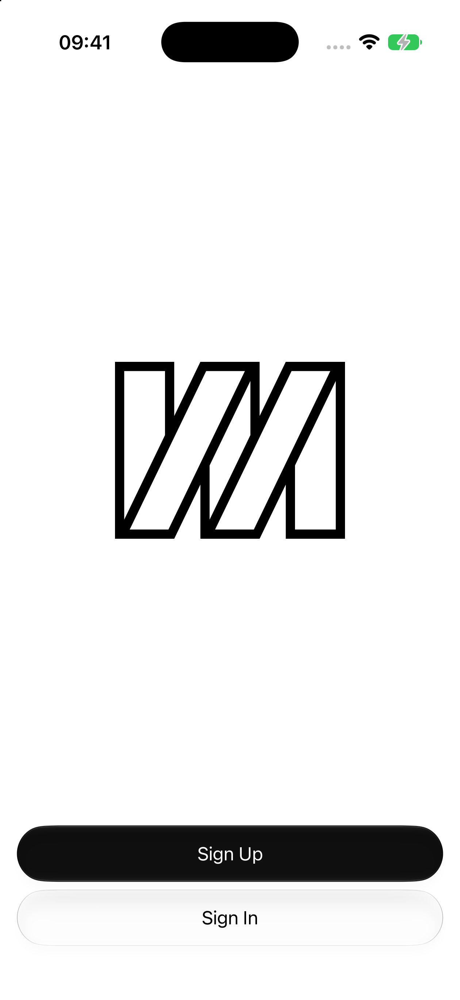
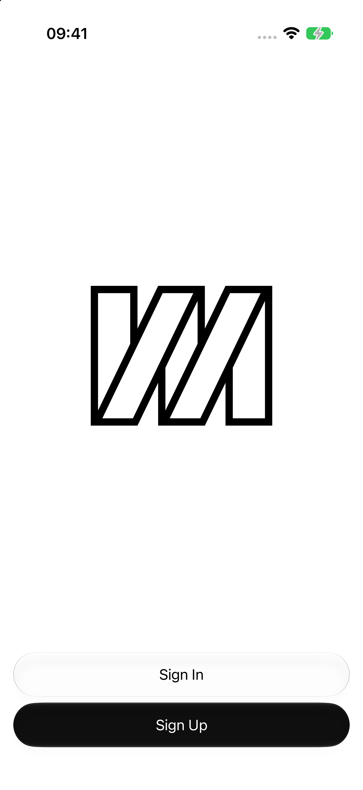
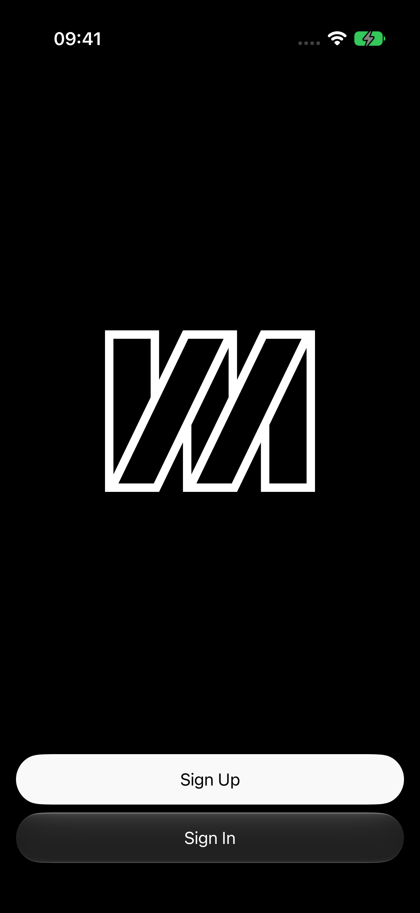
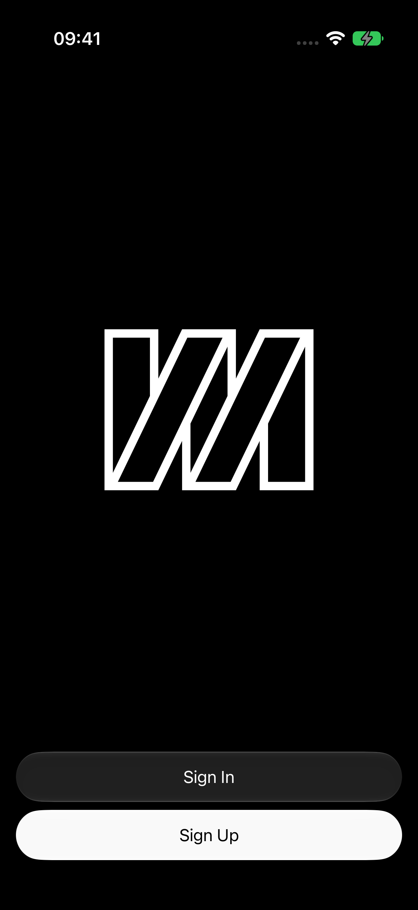

# Welcome action order

Captured from the running Production-flavor app on an iPhone Air simulator,
iOS 27.0 (24A5370g), built with Xcode 27 beta (27A5209h), on 2026-09-15.
Both versions use the same device, default text size, and status-bar settings.
The screenshots contain no personal account data.

Before: `2ae2451`. After: this change, with secondary **Sign In** above primary
**Sign Up**, matching the prototype's Welcome screen. The logo, shared controls,
and production navigation and account behavior are unchanged.

| Appearance | Before | After |
| --- | --- | --- |
| Light |  |  |
| Dark |  |  |

The prototype permits dismissing Sign Up, but production disables dismissal once
identity creation has started. This PR preserves that existing behavior.

Local simulator evidence does not verify iOS 18/26 appearance, signed-device
behavior, or hands-on VoiceOver/Voice Control use. Xcode 26's iOS platform was
unavailable locally; the repository's deployment target and CI toolchain remain
unchanged. Product acceptance remains with the user.
